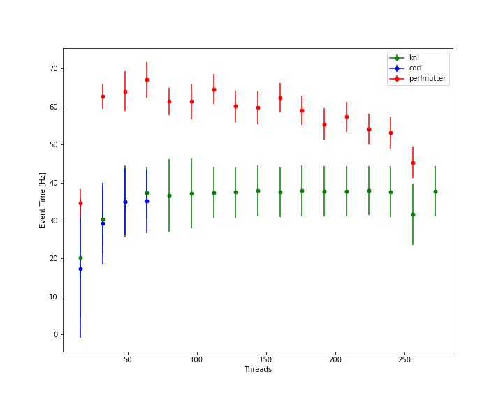

## 06/02/2022

* Added slurm scripts to run clara
    * Uses clara from cvmfs
    * Currently set to `5.0.2_8.0.0`
* Minor updates to clara.sh
    * clara seems to pick an incorrect address for staring dpe
    * I just set it to 127.0.0.1
    * Might be able to pick it from an environment or `ip addr`
* Changes to yaml file
    * Coulnd't find `CVTSecondPassEngine` so I commented it out 
    * Had to set `MAGFIELDS` relative to `schema_dir` 
* My crude threading test
    * Uses `worker.perlmutter.array.sh` to start 16 jobs
    * Each job has a differnt number of threads bases on array number * 16
    * Will go through the proper threading procedure to be consistent
    * Need to look into how NUMA is set in slurm by default

